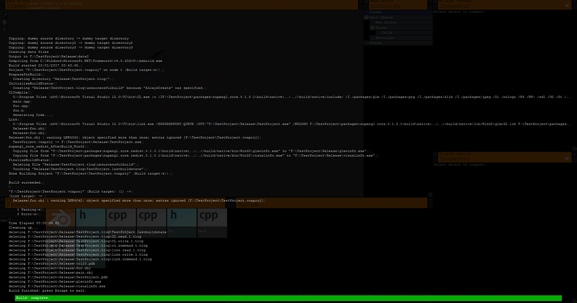
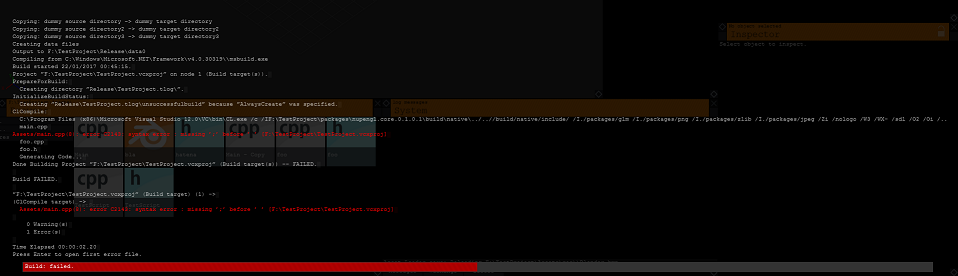

# Engine Diaries #1

Hi. So I have been working on a OpenGl project to create a game engine running on C++. And seeing the amount of sh*t i can learn from this project, it would be a good idea for me to log my progress here, as well as to introduce some key concepts and algorithms i used.

日本語では書きません。めんどくさいので。 (I won't write in Japanese.)

## Script compiling

&nbsp;&nbsp;So to allow users to add their own code, and allowing SceneObjects to call CreateComponent() with the correct script instance, some form of script serialization should be in order. Now C++ does not support native string-to-class conversions, so saving a list of headers in xml or similar format would be useless.

&nbsp;&nbsp;Now after a few nights I figured the only way to do this would be the manual way: generate script resolvers. Headers would be serialized as indexes, and `GetComponent()` would call `map[index]`, returning the SceneScript as shown below. Note that for a script to be attacheable on objects, they should extend the SceneScript class, which implements core classes like `Start()` and `Update()`. The header is as follows:

``` cpp
#include <unordered_map>
#include "Engine.h"
typedef SceneScript(*sceneScriptInstantiator)();
class SceneScriptResolver {
public:
    SceneScriptResolver();
    std::vector<sceneScriptInstantiator> map;
};
```

... and the following generated on compile time (of the game, not the engine):

``` cpp
#include "SceneScriptResolver.h"
#include "Engine.h"

#include "boo.h"
Boo _Inst0() { return new Boo(); }

#include "foo.h"
Foo _Inst1() { return new Foo(); }

using namespace std;

SceneScriptResolver::SceneScriptResolver() {
    map.push_back(&Inst0);
    map.push_back(&Inst1);
}
```

&nbsp;&nbsp;Now all we need to do is to include all those scripts in the vcxproj file, and that is simple enough so I would leave it there. (Actually I haven't done it yet XD)

## *Actual* compiling (Msbuild)

&nbsp;&nbsp;Now to build the game, calling Msbuild would be necessary. The problem is that we want to show the build progress in the engine window, and block all editing until it finishes (or fails). Calling `CreateProcess()` with redirected stdio did the trick, but as Msbuild won't shut down after it compiles, manual parsing it's output messages was done to check it's status. The actual code for `DoMsBuild()` is shown below. Unimportant lines are omitted with `//..` and error handling removed.

``` cpp
    LPDWORD word;
    char s[255];
    DWORD i = 255;
    if (RegGetValue(HKEY_LOCAL_MACHINE, "SOFTWARE\\Microsoft\\MSBuild\\ToolsVersions\\4.0",
     "MSBuildToolsPath", RRF_RT_ANY, nullptr, &s, &i) == ERROR_SUCCESS) {
        SECURITY_ATTRIBUTES sa;
        //..
        HANDLE stdOutR, stdOutW;
        CreatePipe(&stdOutR, &stdOutW, &sa, 0);
        SetHandleInformation(stdOutR, HANDLE_FLAG_INHERIT, 0);
        STARTUPINFO startInfo;
        //..
        string ss = (string(s) + "\\msbuild.exe");

        bool failed = true;
        byte FINISH = 0;
        //actually building the game. Project file hardcoded for testing. Note that currentDirectory is set
        //to project folder to prevent msbuild using the engine's sln project files.
        if (CreateProcess(ss.c_str(), "F:\\TestProject\\TestProject.vcxproj /nr:false /t:Build
         /p:Configuration=Release /v:n /nologo /fl /flp:LogFile=F:\\TestProject\\BuildLog.txt",
         NULL, NULL, true, 0, NULL, "F:\\TestProject\\", &startInfo, &processInfo) != 0) {
            DWORD w;
            do {
                //read messages in loop to prevent hogging
                w = WaitForSingleObject(processInfo.hProcess, 0.5f);
                //..
                if (bSuccess && dwRead > 0) {
                    string s(chBuf, dwRead);
                    out += s;
                }
                //basically string.split
                for (int r = 0; r < out.size();) {
                    int rr = out.find_first_of('\n', r);
                    if (rr == string::npos)
                        rr = out.size() - 1;
                    string sss = out.substr(r, rr - r);
                    e->AddBuildLog(e, sss);
                    //if one of the following lines appear, build has finished.
                    if (sss.substr(0, 16) == "Build succeeded.") {
                        failed = false;
                        FINISH = 1;
                    }
                    else if (sss.substr(0, 12) == "Build FAILED") {
                        FINISH = 1;
                    }
                    r = rr + 1;
                }
                if (FINISH == 1 && e->buildLog[e->buildLog.size() - 1].substr(0, 13) == "Time Elapsed ")
                    FINISH = 2;
            } while (w == WAIT_TIMEOUT && FINISH != 2);
            return (!failed);
        }
        //..
```

The output looks something like this:


And if the build fails, each line is parsed to find errors (basically a string matching _": error C"_), and set to open the corresponding file automatically. Explanation omitted by simplicity.


That's it, thanks for reading! Bye. Feel free to contact me via Twitter @chokomancarr.

[next article](http://not_written_yet)