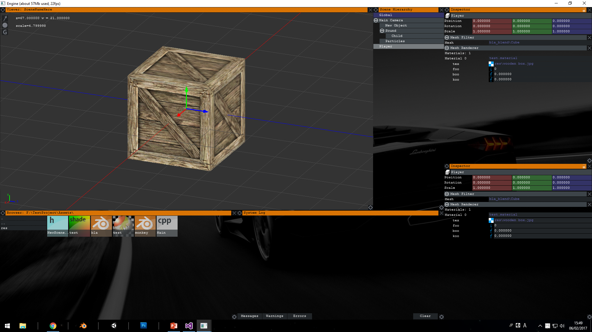

# Engine Diaries #2

[previous article](blog0121.html)

There goes my second year. Sigh. Hope i didn't fail any subjects lol not funny

## Importing models

First thing first, exporting a readable format from Blender. *obj?? fbx?? Why not use them??* Well, the same reason I am trying to write this engine this whole time. Gonna stop explaining that, ok?
Exporting itself is pretty straightforward. Read all meshes' transformations and mesh data, and write to respective files. Something like this:

```python
def execute(self):
    pos0 = self.arg.index("?")
    dirr = self.arg[:pos0]
    print (dirr)
    if os.access(dirr, os.W_OK) is False:
        print("!permission denied : " + dirr)
        return False
    name = self.arg[(pos0+1):]
    print(name)
    #self.path = os.path.join(dirr, name)
    print ("!writing to: " + dirr + name + ".blend.meta")

    #write mesh list to main .meta
    file2 = open(dirr + name + ".blend.meta", "wb")
    self.write(file2, "KTM123\n")
    for obj in self.scene.objects:
        if obj.type != 'MESH':
            continue
        print ("obj " + obj.name)
        self.write(file2, "obj " + obj.name)
        if obj.parent:
            self.write(file2, " \x00prt " + obj.parent.name)
        poss = obj.location
        self.write(file2, " \x00pos {:f} {:f} {:f}".format(poss[0], poss[1], poss[2]))
        rott = obj.rotation_quaternion
        self.write(file2, " \x00rot {:f} {:f} {:f} {:f}".format(rott[0], rott[1], rott[2], rott[3]))
        scll = obj.scale
        self.write(file2, " \x00scl {:f} {:f} {:f}\n".format(scll[0], scll[1], scll[2]))

        print ("!writing to: " + dirr + name + "_blend\\" + obj.name + ".mesh.meta")
        file = open(dirr + name + "_blend\\" + obj.name + ".mesh.meta", "wb")
        self.write(file, "KTO123\r\n")

        self.write(file, "  obj " + obj.name + " [\r\n")
        obj.modifiers.new("tria", 'TRIANGULATE')
        m = obj.to_mesh(bpy.context.scene, True, 'PREVIEW')
        for loop in m.loops:
            vert = m.vertices[loop.vertex_index]
            self.write(file, "    vrt {} {:f} {:f} {:f}\r\n".format(loop.index, vert.co[0], vert.co[1], vert.co[2]))
            self.write(file, "    nrm {} {:f} {:f} {:f}\r\n".format(loop.index, vert.normal[0], vert.normal[1], vert.normal[2]))
        self.write(file, "\r\n")
        for poly in m.polygons:
            self.write(file, "    tri {} ".format(poly.material_index))
            for loop_index in poly.loop_indices:
                self.write(file, " {}".format(loop_index))
            self.write(file, "\r\n")
        self.write(file, "\r\n")
        if len(m.uv_layers) > 0:
            i = 0
            for uvl in m.uv_layers[0].data:
                self.write(file, "    uv0 {} {} {} \r\n".format(i, uvl.uv[0], uvl.uv[1]))
                i = i+1
        #if obj.type == 'MESH' and m.shape_keys:
        #    for block in m.shape_keys.key_blocks:
        #        self.write(file, "    shp " + block.name + "\r\n")
        self.write(file, "\r\n  ]\r\n")
        file.close()
    file2.close()

def write (self, file, _str):
    file.write(_str.encode())
```

Note that the file path is passed as command line argument when invoking this script. Also, the file contents are incomplete. Just gonna add them as I go on.

Now the invoking part is the hard part. Originally, I would just call CreateProcess with args and get done with it, but *I need it to print a debug log to, if possible, the engine output window*. So the obvious thing is to redirect stdio and do print() in Python, but **Blender will crash when its stdio is redirected**. Fk.

Now for the dirty part. To read io and not kill Blender in the process, Blender is invoked separately by creating a command prompt, redirecting that window's stdio, and invoking Blender *manually* by command lines. Yeah.

```cs
SECURITY_ATTRIBUTES sa;
sa.nLength = sizeof(SECURITY_ATTRIBUTES);
sa.bInheritHandle = TRUE;
sa.lpSecurityDescriptor = NULL;
HANDLE stdOutR, stdOutW, stdInR, stdInW;
if (!CreatePipe(&stdInR, &stdInW, &sa, 0)) {
    cout << "failed to create pipe for stdin!";
    return false;
}
if (!SetHandleInformation(stdInW, HANDLE_FLAG_INHERIT, 0)){
    cout << "failed to set handle for stdin!";
    return false;
}
if (!CreatePipe(&stdOutR, &stdOutW, &sa, 0)) {
    cout << "failed to create pipe for stdout!";
    return false;
}
if (!SetHandleInformation(stdOutR, HANDLE_FLAG_INHERIT, 0)){
    cout << "failed to set handle for stdout!";
    return false;
}
STARTUPINFO startInfo;
PROCESS_INFORMATION processInfo;
ZeroMemory(&startInfo, sizeof(STARTUPINFO));
ZeroMemory(&processInfo, sizeof(PROCESS_INFORMATION));
startInfo.cb = sizeof(STARTUPINFO);
startInfo.hStdInput = stdInR;
startInfo.hStdOutput = stdOutW;
startInfo.dwFlags |= STARTF_USESTDHANDLES;

//create meta directory
string ss = s.substr(0, s.find_last_of('.'));
string sss = ss + "_blend";
if (!CreateDirectory(sss.c_str(), NULL)) {
    for (string file : IO::GetFiles(sss))
        DeleteFile(file.c_str());
}
SetFileAttributes(sss.c_str(), FILE_ATTRIBUTE_HIDDEN);
string ms(s + ".meta");
DeleteFile(ms.c_str());

bool failed = true;
string cmd1(e->_blenderInstallationPath.substr(0, 2) + "\n"); //root
string cmd2("cd " + e->_blenderInstallationPath.substr(0, e->_blenderInstallationPath.find_last_of("\\")) + "\n");
string cmd3("blender \"" + s + "\" --background --python \"" + e->dataPath + "\\Python\\blend_exporter.py\" -- \"" + s.substr(0, s.find_last_of('\\')) + "?" + ss.substr(ss.find_last_of('\\') + 1, string::npos) + "\"\n");
//outputs object list, and meshes in subdir
if (CreateProcess("C:\\Windows\\System32\\cmd.exe", 0, NULL, NULL, true, CREATE_NO_WINDOW, NULL, "F:\\TestProject\\", &startInfo, &processInfo) != 0) {
    cout << "executing Blender..." << endl;
    DWORD dwWrite;
    bSuccess = WriteFile(stdInW, cmd1.c_str(), cmd1.size(), &dwWrite, NULL) != 0;
    if (bSuccess && dwWrite != 0) {
        //...
```

I know. But this is what worked. So if you have a better solution to doing this please PM me, thanks.

The next thing is to show the model in Engine. Woudn't be harder, right?
Each Blender file is added to a list, and pressing *Shift-A* calls it up for addition to the scene. I really love Blender, that's why.


Doing that creates an `Mesh` instance of the object, which is referenced by a `MeshFilter` component, which is in turn referenced by a `MeshRenderer` component responsible for rendering. The `MeshRenderer` will also automatically allocate `Material` slots for assigning to.

Now each material hosts a shader, which may contain several variables for filling, Textures and so on. Thus, a special column, *VARSTART - VAREND* is allocated in the shader code for said variables, where variables with the same name in the vertex and fragment code would be filled in by the renderer. A typical shader would thus look like this:

```glsl
#include Commons

VARSTART
int range(0, 10) foo = 1;
float range(0, 1) boo = 1;
float koo=0;
texture tex;
VAREND

VERTSTART
void main(){
    gl_Position = _P*_MV*vec4(pos.x, pos.y, pos.z, 1);
    uv = texCoord;
}
VERTEND

FRAGSTART
uniform sampler2D tex;
uniform int foo;
uniform float boo;
uniform float koo;

void main()
{
    Output(texture(tex, uv + vec2(foo*(boo+koo), 0)).rgb, vec3(1, 0, 0), 1, 0, 0);
}
FRAGEND
```

*Markdown refused highlight my classes and enums. Please look at the source for clearer image.

Also note that as glsl does not support *#import* macros, they had to be parsed manually. Though, and I [quote](https://www.opengl.org/discussion_boards/showthread.php/169209-include-in-glsl),

>I find it difficult to believe that anyone inclined to write OpenGL shader code would be incapable of writing similar functionality in less than 10 minutes.

LUL.

Anyway, Textures are imported and handled the same way as Blender files (the same for all assets in fact), and stored in void pointers (yes, yes, I know) like so.

```cs
unordered_map<ASSETTYPE, vector<string>> normalAssets;
unordered_map<ASSETTYPE, vector<void*>> normalAssetCaches;

void DrawAssetSelector(float x, float y, float w, float h, Vec4 col, ASSETTYPE type, float labelSize, Font* labelFont, int* tar, callbackFunc func = nullptr, void* param = nullptr);
ASSETID GetAssetInfo(string p, ASSETTYPE &type, ASSETID& i);
ASSETID GetAssetId(void* p), GetAssetId(void* p, ASSETTYPE& t);

void ResetAssetMap();
void ReloadAssets(string path, bool recursive);
bool ParseAsset(string path);
void* GetCache(ASSETTYPE type, int id);
void* GenCache(ASSETTYPE type, int id);
```

Each material is then invoked for drawing on the Repaint stage like so.

```cs
void DrawSceneObjectsOpaque(EB_Viewer* ebv, vector<SceneObject*> oo) {
    for (SceneObject* sc : oo)
    {
        glPushMatrix();
        Vec3 v = sc->transform.position;
        //rotation matrix here
        glTranslatef(v.x, v.y, v.z);
        for (Component* com : sc->_components)
        {
            if (com->componentType == COMP_MRD || com->componentType == COMP_CAM)
                com->DrawEditor(ebv);
        }
        DrawSceneObjectsOpaque(ebv, sc->children);
        glPopMatrix();
    }
}
```

And in MeshRenderer.DrawEditor():

```cs
MeshFilter* mf = (MeshFilter*)dependacyPointers[0];
if (mf == nullptr || mf->mesh == nullptr || !mf->mesh->loaded)
    return;
glEnableClientState(GL_VERTEX_ARRAY);
glPolygonMode(GL_FRONT_AND_BACK, (ebv->selectedShading == 0) ? GL_FILL : GL_LINE);
glVertexPointer(3, GL_FLOAT, 0, &(mf->mesh->vertices[0]));
glLineWidth(1);
for (uint m = 0; m < mf->mesh->materialCount; m++) {
    if (materials[m] == nullptr)
        continue;
    materials[m]->ApplyGL();
    glEnableVertexAttribArray(0);
    glEnableVertexAttribArray(1);
    glVertexAttribPointer(0, 3, GL_FLOAT, GL_TRUE, 0, &(mf->mesh->vertices[0]));
    glVertexAttribPointer(1, 2, GL_FLOAT, GL_TRUE, 0, &(mf->mesh->uv0[0]));
    glDrawElements(GL_TRIANGLES, mf->mesh->_matTriangles[m].size(), GL_UNSIGNED_INT, &(mf->mesh->_matTriangles[m][0]));
    glDisableVertexAttribArray(0);
    glDisableVertexAttribArray(1);
}
glUseProgram(0);
glDisableClientState(GL_VERTEX_ARRAY);
```

Aaaaand in Material.ApplyGl():

```cs
glUseProgram(shader->pointer);
GLint mv = glGetUniformLocation(shader->pointer, "_MV");
GLint p = glGetUniformLocation(shader->pointer, "_P");
glUniformMatrix4fv(mv, 1, GL_FALSE, matrix);
glUniformMatrix4fv(p, 1, GL_FALSE, matrix2);
for (auto a : vals[SHADER_INT])
    if (a.second != nullptr)
        glUniform1i(a.first, *(int*)a.second);
for (auto a : vals[SHADER_FLOAT])
    if (a.second != nullptr)
        glUniform1i(a.first, *(float*)a.second);
for (auto a : vals[SHADER_VEC2]) {
    if (a.second == nullptr)
        continue;
    Vec2* v2 = (Vec2*)a.second;
    glUniform2i(a.first, v2->x, v2->y);
}
int ti = 0;
for (auto a : vals[SHADER_SAMPLER]) {
    if (a.second == nullptr)
        continue;
    MatVal_Tex* tx = (MatVal_Tex*)a.second;
    if (tx->tex == nullptr)
        continue;
    glUniform1i(a.first, ti);
    glActiveTexture(GL_TEXTURE0 + ti);
    glBindTexture(GL_TEXTURE_2D, tx->tex->pointer);
}
```

All of that for this image:



Bye.

[next article](not.written.yet)