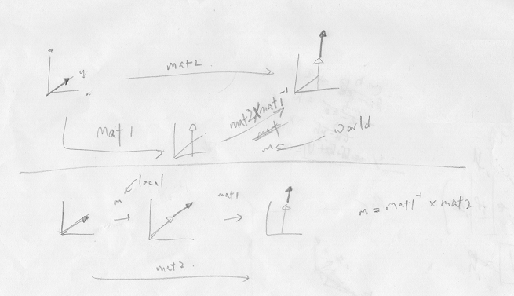

# Exporting Armature Animation from Blender3D

Hello. While writing my game engine, I came across the need to write a .blend file exporter for 3d models. Now the mesh part is easy. Armature, so-so. The problem was with animations. This problem took me a good part of a whole week to resolve, _because the Blender API was such a bliss to read_, so I guess it would be a good idea to document it below.

First, we are required to export _local matrices_ for each bone. [The Blender API for posebone](https://docs.blender.org/api/blender_python_api_2_77_1/bpy.types.PoseBone.html)[^1] provides a few matrix variables for each pose bone, as listed below.

[^1]: we must use armature_object._pose_.bones instead of ._data_.bones when exporting animations, or else the animation data will not be reflected.

- matrix
- matrix_basis
- matrix_channels

Of these 3, _matrix_basis_ is a local matrix (relative to parent bone), while the others are 'object' matrices (relative to armature object). As we want local transforms, let's use _matrix_basis_ for now (spoiler alert: It won't work).

We can query the TRS (Translation, Rotation, Scale) of a bone by first applying the action (_conveniently_ undocumented), setting the appropriate frame, and getting the TRS themselves, as shown below.

``` python
arm.animation_data.action = action
self.scene.frame_set(0)
mat = bone.matrix_basis
TRS = [mat.to_translation(), mat.to_quaternion(), mat.to_scale()]
```

you might want to set the armature to pose mode before exporting, or else all animations will be in rest position (_I'm looking at you, Unity_).

``` python
obj.data.pose_position = 'POSE'
```

Now the problem arises when constraints are used. For example, when an IK modifier is used, the driven bone's matrix_basis will _NOT_ be changing throughout the animation (also, _conveniently_, not clearly documented[^2]).

[^2]: if you read from bottom to top, the term "before constraints" from _matrix_channel_ can be reapplied. But yeah.

We are thus forced to use _matrix_. Now _matrix_ is an 'object' matrix, so some matrix math is required. First, let's look at this _beautifully-drawn_ figure below.



Therefore, if we want to get the local matrix of bone1, which is a child of bone2, by doing `mat2 * mat1<sup>-1</sup>`, you get the object-spaced "local" matrix, that is, rotating from parent rotation to child rotation in object space. On the other hand, by doing `mat1<sup>-1</sup> * mat2`, you get the _real_ local space, where the rotation is in the parent's space.

So in the end, the exported file contains an array of TRS values, which then our C++ script reads and applies to bone transforms. On a side-note, unlike _matrix_basis_, resolving _matrix_ gives the relative position from the parent's base, not the tip, so no consideration will be needed when applying to the game asset, where bones are just normal transforms.

On another note, the TRS values have their respective curves and names, for example "bone1/bone2/bone3/[T/R/S]". These names will be used to identify the curves, so other armatures with identical bone names will be able to use them. Here's a snippet of applying a frame of animation. The full code can be found [here](https://github.com/chokomancarr/ChokoEngine/blob/master/OpenGl1_Editor/src/SceneObjects.cpp#L1317).

``` cpp
uint i = 0;
for (auto& bn : _allbones) {
    auto id = _boneAnimIds[i];
    if (id != -1) {
        Vec4 loc = anm->Get(id);
        Vec4 rot = anm->Get(id + 1);
        Vec4 scl = anm->Get(id + 2);
        bn->tr->localPosition(loc);
        bn->tr->localRotation(*(Quat*)&rot);
        bn->tr->localScale(scl);
        MatFunc::FromTRS(bm.second->tr->_localPosition, bm.second->tr->_localRotation, bm.second->tr->_localScale);
    }
    i++;
}
```

Bye.

[Follow me on Twitter!](https://twitter.com/chokomancarr)